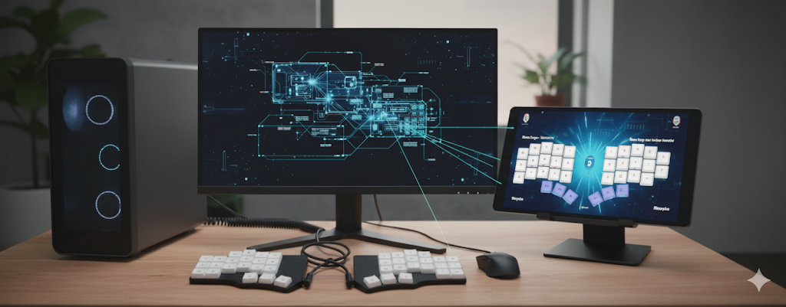

# Keyboard Layers App companion

Display the selected keyboard layer layout on screen to assist your to memorize the key's locations.

It allows you to display the layout in a remote screen, so you can use a tablet or similar to save space on your main screen.

Supports the default layouts of [Miryoku QMK](https://github.com/manna-harbour/miryoku_qmk) and you can define your own.

Demonstration video:

[](https://www.youtube.com/watch?v=WpxBLXetmFg)

## Display on a remote host

Start the program with the `--remote` option on the host and with `--client` on your tablet - the host will discover the client automatically.

Optionally, the client IP can be specified.



## Layouts

The current layouts are:
 - Base: QWERY
 - Nav: Vi
 - Mouse: Vi 
 - Media/ Num/ Syn/ Fun

The following alternative Layouts are available:
 - Base: Colemak-DH / Inverted Colemak-DH 
 - Nav: Default
 - Mouse: Default

To use any of the alternative layouts, rename the corresponding image file in the folder `assets` to the default name.

#### Define your own layouts

Build your own layouts using [KLE](http://www.keyboard-layout-editor) - you can find examples on the [Miryoku QMK repo](https://github.com/manna-harbour/miryoku/tree/master/data/layers/) or use [mine](https://github.com/maatthc/miryoku_qmk/tree/miryoku/data/layers).

Use the "Upload JSON" button in the "Raw data" tab. 

Download the PNG files, copy it to the `assets` folder and rename it properly.

## Internals

It works by sending different Function keys (F13 to F19) to the host when switching between layers.

It requires the following changes to your miryoku_qmk firmware:

File: keyboards/<your_keyboard>/keymaps/manna-harbour_miryoku/keymap.c

```c
// Notifies the host of the layer change
// Layers reference: users/manna-harbour_miryoku/miryoku_babel/miryoku_layer_list.h
layer_state_t layer_state_set_user(layer_state_t state) {
    switch (get_highest_layer(state)) {
        case 0:
            // send f13
            SEND_STRING(SS_TAP(X_F13));
            break;
        case 4:
            SEND_STRING(SS_TAP(X_F14));
            break;
        case 5:
            SEND_STRING(SS_TAP(X_F15));
            break;
        case 6:
            SEND_STRING(SS_TAP(X_F16));
            break;
        case 7:
            SEND_STRING(SS_TAP(X_F17));
            break;
        case 8:
            SEND_STRING(SS_TAP(X_F18));
            break;
        case 9:
            SEND_STRING(SS_TAP(X_F19));
            break;
        default:
            uprintf("Layer not mapped: %d\n", get_highest_layer(state));
            break;
    }
    return state;
}
```

## Requirements

- Firmware changes described in [Internals](#Internals)
- Python 3
- Kivy
- Keyboard
- Tenacity
- Argparse

## Installation

### Linux

__***** Note for Gnome users__ 

If the Settings app is showing up when you press the function keys, you can disable the shortcuts by running the following command: 

`gsettings set org.gnome.settings-daemon.plugins.media-keys control-center-static "['']"`

#### Install Dependencies
`sudo pip install kivy keyboard tenacity argparse`

#### Run the script as root
`sudo python keyboard_layers.py`

##### Remote Display

Host (as root):

`sudo python keyboard_layers.py --remote`

Client (as normal user):

`python keyboard_layers.py --client`
